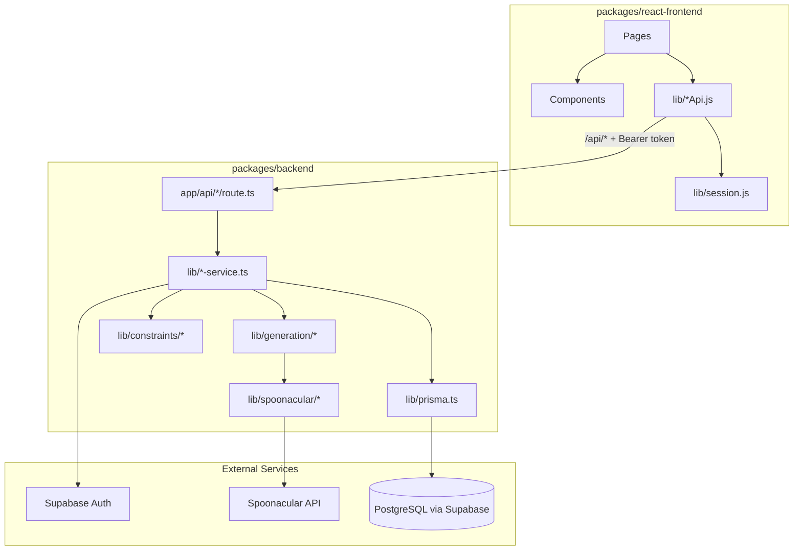

# Monorepo Structure

This repository is a **multi-package monorepo** for the Recipe Collaboration App — a group cooking platform where users manage pantries, collaborate in groups, and generate meal bundles from shared ingredients and dietary constraints.

The repo is **not** configured as an npm workspace yet. Each package has its own `package.json` and `node_modules`. Install dependencies and run scripts inside the package you are working on. Shared concerns (database schema, formatting, CI) live at the repository root.

## Top-Level Layout

```
307-Project/
├── packages/
│   ├── react-frontend/     # Vite + React SPA (client)
│   └── backend/            # Next.js API server
├── prisma/                 # Shared database schema and migrations
├── docs/                   # Architecture documentation (this file + UML diagram)
├── .github/workflows/      # CI and deployment automation
├── package.json            # Root tooling (Prettier, Prisma CLI)
└── README.md
```

## Architecture Overview

The system follows a **decoupled frontend + API backend** pattern. The React SPA talks to the backend over relative `/api/*` paths. In production, two Vercel projects are used: the frontend rewrites `/api/*` to the backend so both appear as a single origin.



## Package Responsibilities

### `packages/react-frontend`

| Layer | Location | Role |
|-------|----------|------|
| **Routing** | `src/App.jsx` | React Router routes for landing, auth, pantry, groups, recipes, profile |
| **Pages** | `src/pages/` | Screen-level UI (e.g. `PantryPage`, `GroupDetailPage`, `ProfilePage`) |
| **Components** | `src/components/` | Reusable UI (`AppLayout`, `NotificationBell`, `BundleCandidateCard`, etc.) |
| **API clients** | `src/lib/*Api.js` | Thin fetch wrappers per domain (`authApi`, `groupApi`, `pantryApi`, `constraintsApi`, `notificationApi`) |
| **HTTP utilities** | `src/lib/api.js`, `httpResponse.js` | Shared `apiFetch` with auth header injection and 401 refresh retry |
| **Session** | `src/lib/session.js` | Client-side auth session storage |
| **Styles** | `src/styles/index.css` | Global CSS |

**Stack:** Vite 7, React 19, React Router 7, Vitest, ESLint.

**Deployment:** Static SPA built to `dist/`, deployed as a separate Vercel project with `/api/*` rewrites to the backend.

### `packages/backend`

| Layer | Location | Role |
|-------|----------|------|
| **API routes** | `src/app/api/**/route.ts` | Next.js App Router handlers — thin controllers that parse requests and delegate to services |
| **Domain services** | `src/lib/*-service.ts` | Business logic for profiles, ingredients, groups, notifications, auth |
| **Generation** | `src/lib/generation/` | Bundle candidate orchestration, constraint loading, group context |
| **Constraints** | `src/lib/constraints/` | User dietary/allergy constraint normalization, validation, and in-memory store |
| **Spoonacular** | `src/lib/spoonacular/` | External recipe/ingredient API client, fixtures for mock mode, recipe mapping |
| **Auth integration** | `src/lib/supabase-auth.ts`, `auth-service.ts` | Supabase session management, OTP, magic link, password auth |
| **Data access** | `src/lib/prisma.ts` | Prisma client singleton |
| **Generated ORM** | `src/generated/prisma/` | Prisma Client output (do not edit by hand) |
| **Shared utilities** | `src/lib/api-error.ts`, `api-response.ts`, `request-user.ts`, `input-normalization.ts` | Error handling, response helpers, auth extraction, input sanitization |
| **Tests** | `src/lib/*.test.ts`, `src/test/` | Vitest unit and integration tests |

**Stack:** Next.js 16, TypeScript, Prisma 7, Vitest, ESLint.

**Deployment:** Next.js app deployed as a separate Vercel project. Serves all `/api/*` endpoints.

### `prisma/` (repository root)

Shared database layer used exclusively by the backend:

- `schema.prisma` — canonical data model (profiles, ingredients, groups, menus, recipes, notifications)
- `migrations/` — versioned SQL migrations applied to PostgreSQL

The Prisma client is generated into `packages/backend/src/generated/prisma` via:

```bash
cd packages/backend && npm run prisma:generate
```

### Root `package.json`

Provides repo-wide tooling only:

- `npm run format` — Prettier across all packages
- Prisma CLI as a dev dependency for schema management

## Module-to-Package Mapping

The application is organized around these functional modules. The table below shows where each module is implemented.

| Module | Description | Frontend | Backend |
|--------|-------------|----------|---------|
| **Authentication** | Sign-in, sign-up, magic link, OTP, session refresh | `authApi.js`, `AuthCallbackPage`, `SignInPage`, `session.js` | `auth-service.ts`, `supabase-auth.ts`, `app/api/auth/**` |
| **User profiles** | Display name, avatar, account management | `ProfilePage`, `accountApi.js` | `profile-service.ts`, `app/api/profiles/**` |
| **Dietary constraints** | Allergies, diets, cuisines, spice level, never-include ingredients | `ProfilePage`, `constraintsApi.js` | `profile-constraints-service.ts`, `constraints/`, `app/api/profile/constraints` |
| **Pantry / ingredients** | Per-user ingredient inventory | `PantryPage`, `pantryApi.js`, `IngredientTypeahead` | `ingredient-service.ts`, `ingredient-catalog-service.ts`, `app/api/ingredients/**` |
| **Groups & membership** | Create/join groups, invite codes, member roles | `GroupsPage`, `GroupDetailPage`, `JoinGroupPage`, `groupApi.js` | `group-membership-service.ts`, `group-service.ts`, `app/api/groups/**` |
| **Group settings** | Missing-ingredient policy, staples configuration | `GroupDetailPage` | `group-settings-service.ts`, `app/api/groups/[groupId]/settings` |
| **Bundle generation** | AI-assisted meal bundle candidates from group pantry | `BundleCandidateCard`, `GroupDetailPage` | `generation/`, `bundle-validator.ts`, `app/api/groups/[groupId]/bundle-candidates/**`, `app/api/generation` |
| **Notifications** | In-app alerts (e.g. ingredient added) | `NotificationBell`, `notificationApi.js` | `notification-service.ts`, `app/api/notifications/**` |
| **Spoonacular integration** | External recipe search and ingredient catalog | `IngredientTypeahead` | `spoonacular/`, `app/api/spoonacular/**` |

## Request Flow

A typical authenticated request follows this path:

1. **Frontend page** calls a domain API client (e.g. `groupApi.listGroups()`).
2. **`apiFetch`** attaches the Supabase access token from `session.js`.
3. **Next.js route handler** extracts the user via `getRequestUserId(request)`.
4. **Service layer** validates input, runs business logic, and reads/writes via Prisma or external APIs.
5. **JSON response** is returned; `apiFetch` handles 401 by refreshing the session and retrying once.

## API Surface

All backend endpoints live under `packages/backend/src/app/api/`:

| Prefix | Purpose |
|--------|---------|
| `/api/auth/*` | Authentication flows (password, OTP, magic link, session, account) |
| `/api/profiles/*` | Profile CRUD and `/api/profiles/me` |
| `/api/profile/constraints` | Dietary constraint read/update |
| `/api/ingredients/*` | Pantry CRUD and ingredient catalog |
| `/api/groups/*` | Group CRUD, membership, settings, invite join |
| `/api/groups/[groupId]/bundle-candidates/*` | Bundle generation, selection, load more |
| `/api/generation` | Generation entry point |
| `/api/notifications/*` | List and mark notifications read |
| `/api/spoonacular/*` | Spoonacular mode and definition lookups |

## Shared Infrastructure

| Concern | Location |
|---------|----------|
| **Database** | PostgreSQL (Supabase-hosted), schema in `prisma/schema.prisma` |
| **Auth provider** | Supabase Auth (JWT access/refresh tokens) |
| **Recipe data** | Spoonacular API (with mock/fixture fallback) |
| **CI** | `.github/workflows/ci-testing.yml` — lint, build, and test both packages |
| **Deployment** | Two Vercel projects + optional Azure backend workflow |
| **Formatting** | Root Prettier config (`.prettierrc`) |

## Local Development

Run each package in its own terminal:

```bash
# Backend (port 3000 by default)
cd packages/backend && npm install && npm run dev

# Frontend (port 5173 by default; proxies /api in dev via vite config)
cd packages/react-frontend && npm install && npm run dev
```

The backend `predev` and `prebuild` scripts run `prisma generate` automatically. Ensure `.env.local` in `packages/backend` contains `DATABASE_URL`, `DIRECT_URL`, and Supabase credentials.

## See Also

- [uml-class-diagram.md](./uml-class-diagram.md) — Domain model, entity relationships, and service-layer UML
