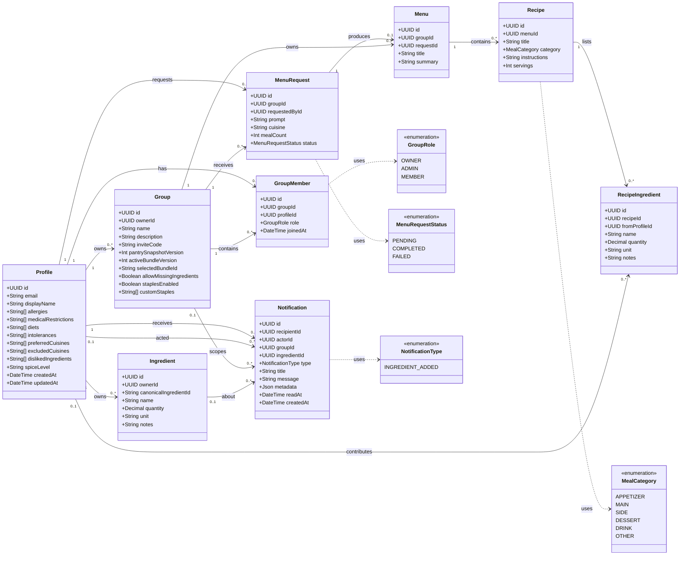

# UML Class Diagram

**Last updated: June 5, 2026**

This diagram models the RecipeCollab domain (the **Model** in our MVC design).
It is derived directly from [`prisma/schema.prisma`](../prisma/schema.prisma),
which is the schema of record; whenever the schema changes, update this diagram
and the date above.

**Diagram source file:** [`docs/diagrams/class-diagram.mmd`](diagrams/class-diagram.mmd)
(Mermaid). The block below renders on GitHub and is kept in sync with that
source. To edit it visually, paste the `.mmd` file into
[mermaid.live](https://mermaid.live).

## Reading the diagram

- **Entities** are the persisted domain classes (Prisma models → Postgres
  tables). Attributes show the key fields; audit timestamps (`createdAt` /
  `updatedAt`) are omitted on most classes for readability.
- **Solid arrows** (`-->`) are associations/relationships with multiplicities
  (e.g. a `Profile` owns `0..*` `Ingredient`s).
- **Dashed arrows** (`..>`) show which enumeration a field draws its value from.
- `GroupMember` and `Menu`/`MenuRequest` are association/junction-style classes:
  `GroupMember` links a `Profile` to a `Group` with a `role`, and a `MenuRequest`
  produces at most one `Menu`.

## Key relationships

- A **Profile** owns its private pantry **Ingredients**, can own and belong to
  **Groups** (membership via **GroupMember** with a **GroupRole**), and receives
  **Notifications**.
- A **Group** collects **MenuRequests**; a completed request yields a **Menu** of
  **Recipes**, each composed of **RecipeIngredients** that may be attributed back
  to the contributing **Profile**.
