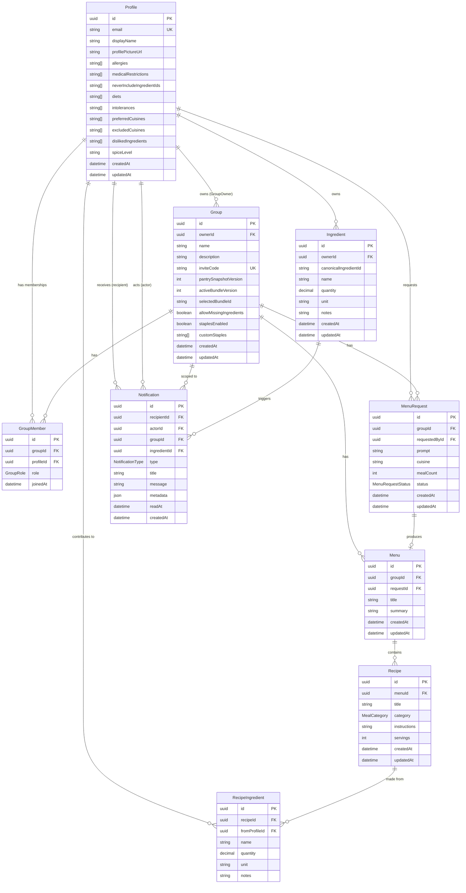
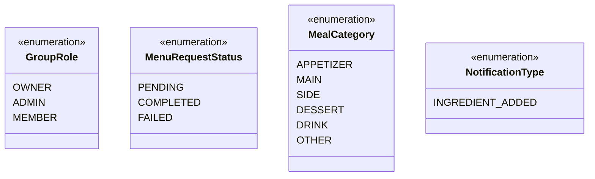
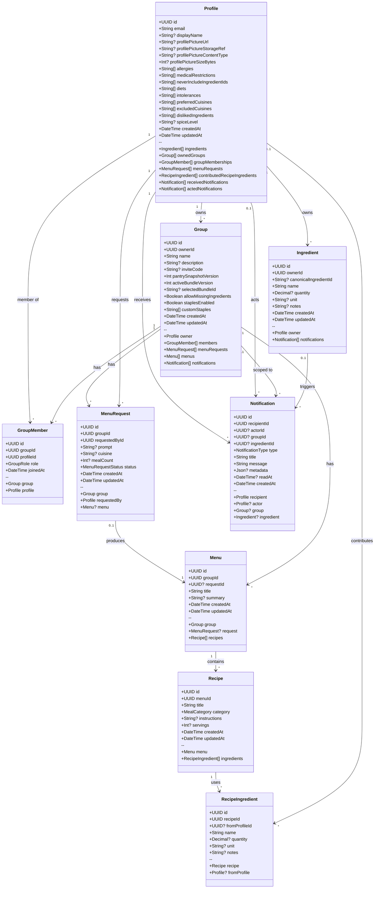
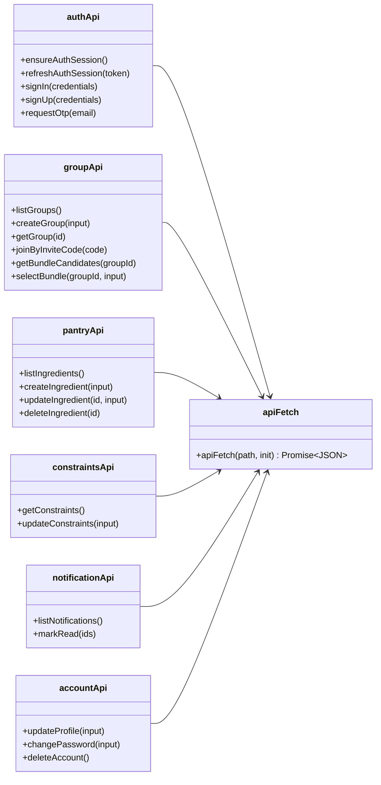

# UML Class Diagram

This document describes the **domain model** (persisted in PostgreSQL via Prisma) and the **application service layer** (implemented in `packages/backend/src/lib/`). Together they form the core object model of the Recipe Collaboration App.

For how these classes map to repository packages, folders, and request flow, see [monorepo-structure.md](./monorepo-structure.md).

## Domain Model (Database Entities)

The canonical schema is defined in `prisma/schema.prisma`. Prisma generates TypeScript types into `packages/backend/src/generated/prisma/`.

### Entity Relationship Diagram

### Enumerations

### Class Diagram (Domain Entities)

## Application Service Layer

Backend business logic is organized into service modules under `packages/backend/src/lib/`. API route handlers are thin and delegate to these services.

```mermaid
classDiagram
  direction TB

  class ApiRouteHandler {
    <<interface>>
    +GET(request) Response
    +POST(request) Response
    +PATCH(request) Response
    +DELETE(request) Response
  }

  class AuthService {
    +requestEmailOtp(input)
    +verifyEmailOtp(input)
    +requestMagicLink(input)
    +signInWithPassword(input)
    +signUpWithPassword(input)
    +refreshSession(input)
    +changePassword(input)
    +deleteAccount(userId)
  }

  class ProfileService {
    +findOrCreateProfileForEmail(email)
    +getProfileById(id)
    +updateProfile(id, input)
    +anonymizeProfileForAccountDeletion(id)
  }

  class ProfileConstraintsService {
    +getUserConstraints(userId)
    +replaceUserConstraints(userId, input)
    +patchUserConstraints(userId, input)
  }

  class IngredientService {
    +listIngredients(ownerId)
    +createIngredient(ownerId, input)
    +updateIngredient(ownerId, id, input)
    +deleteIngredient(ownerId, id)
  }

  class IngredientCatalogService {
    +searchCatalog(query)
    +findCatalogIngredientsByIds(ids)
  }

  class GroupMembershipService {
    +listUserGroups(profileId)
    +createUserGroup(profileId, input)
    +joinGroupByInviteCode(profileId, input)
    +listGroupMembers(groupId, profileId)
  }

  class GroupSettingsService {
    +getGroupSettings(groupId, profileId)
    +updateGroupSettings(groupId, profileId, input)
  }

  class GroupService {
    +getViewerContext(groupId, profileId)
    +listBundleCandidates(groupId, profileId)
    +selectBundleCandidate(groupId, profileId, input)
    +loadMoreBundleCandidates(groupId, profileId)
  }

  class BundleGenerationService {
    +generateInitialCandidates(groupId, request)
    +generateMoreCandidates(groupId, request)
    +getStoredCandidateSet(groupId)
  }

  class BundleOrchestrator {
    +generateBundleTemplates(request, context)
    +generateOneMoreBundleTemplate(request, context)
  }

  class ConstraintsLoader {
    +loadMemberConstraints(groupId)
    +aggregateMemberPreferences(constraints)
  }

  class BundleValidator {
    +buildValidatedCandidateSet(templates, pantry, settings)
  }

  class NotificationService {
    +listUserNotifications(profileId)
    +markNotificationsRead(profileId, ids)
  }

  class SupabaseAuth {
    +signInWithPassword(email, password)
    +signUpWithPassword(email, password)
    +requestEmailOtp(email)
    +verifyEmailOtp(email, otp)
    +refreshSession(refreshToken)
    +getUserFromAccessToken(token)
  }

  class SpoonacularClient {
    +searchRecipes(params)
    +getRecipesInformationBulk(ids)
    +searchIngredients(query)
    +getIngredientInformation(id)
  }

  class PrismaClient {
    +profile
    +ingredient
    +group
    +groupMember
    +menuRequest
    +menu
    +recipe
    +recipeIngredient
    +notification
  }

  ApiRouteHandler ..> AuthService
  ApiRouteHandler ..> ProfileService
  ApiRouteHandler ..> IngredientService
  ApiRouteHandler ..> GroupMembershipService
  ApiRouteHandler ..> GroupService
  ApiRouteHandler ..> NotificationService

  AuthService --> SupabaseAuth
  AuthService --> ProfileService
  ProfileService --> PrismaClient
  ProfileConstraintsService --> PrismaClient
  IngredientService --> PrismaClient
  GroupMembershipService --> PrismaClient
  NotificationService --> PrismaClient

  GroupService --> BundleValidator
  GroupService --> ConstraintsLoader
  BundleGenerationService --> BundleOrchestrator
  BundleGenerationService --> BundleValidator
  BundleGenerationService --> ConstraintsLoader
  BundleOrchestrator --> SpoonacularClient
  IngredientCatalogService --> SpoonacularClient
```

## Frontend Client Layer

The React frontend does not mirror the backend service classes directly. Instead, it exposes small API client modules that map to backend routes:

## Key Relationships Summary

| From | To | Cardinality | Description |
|------|----|-------------|-------------|
| `Profile` | `Ingredient` | 1 : * | Each user owns a personal pantry |
| `Profile` | `Group` | 1 : * | A user can own multiple groups |
| `Profile` | `GroupMember` | 1 : * | A user can belong to multiple groups |
| `Group` | `GroupMember` | 1 : * | A group has many members with roles |
| `Group` | `MenuRequest` | 1 : * | Groups submit generation requests |
| `MenuRequest` | `Menu` | 1 : 0..1 | A completed request may produce one menu |
| `Menu` | `Recipe` | 1 : * | A menu contains multiple recipes |
| `Recipe` | `RecipeIngredient` | 1 : * | Recipes list required ingredients |
| `Profile` | `RecipeIngredient` | 1 : 0..* | Ingredients may be attributed to a contributor |
| `Profile` | `Notification` | 1 : * | Users receive in-app notifications |

## Notes

- **Generated code:** Prisma Client types and query methods are auto-generated; treat `prisma/schema.prisma` as the source of truth for the domain model.
- **In-memory stores:** Some generation and constraint logic (`demo-store`, `constraints/store`, `bundle-candidate-store`) uses in-memory state alongside Prisma persistence during active development of bundle features.
- **External types:** Spoonacular API responses are mapped into internal `BundleTemplate` shapes by `recipe-mapper.ts` before validation and presentation.

